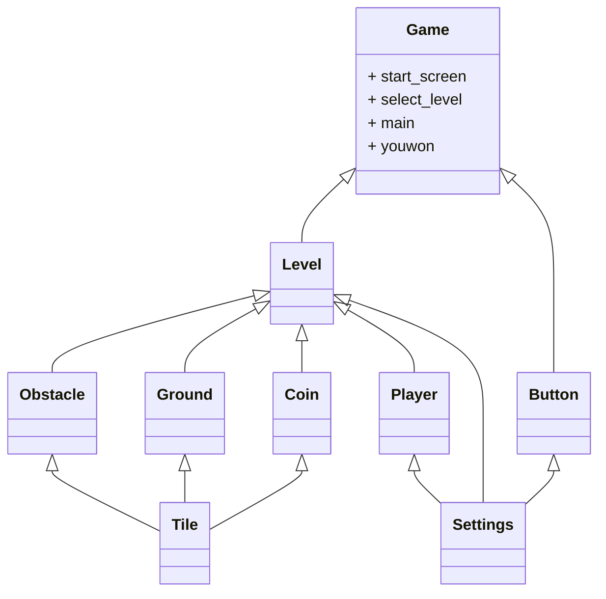

# Catch me ila qedditi


## Description
Catch me ila qedditi est un jeu d'aventure inspiré du célèbre jeu vidéo Power Pamplona, développé dans le cadre d'un projet collaboratif aux Coding Weeks de CentraleSupélec. Le but du jeu est d'échapper au taureau, votre poursuivant, tout en traversant des environnements variés remplis d'obstacles. Pour cela, vous devrez courir, sauter, esquiver et utiliser des bonus. Le défi principal est d'atteindre la destination avec le plus grand score possible sans vous faire attraper par le taureau.

Le jeu contient actuellement deux niveaux. Votre objectif est de terminer la carte avec le meilleur score possible tout en évitant le taureau et en utilisant vos compétences pour surmonter les obstacles. Les joueurs les plus stratégiques pourront également utiliser des power-ups pour maximiser leurs chances de réussite.


### Origine du nom "Catch me ila qedditi"

"**Catch me ila qedditi**
"Le nom "Catch me ila qedditi" joue sur un mélange ludique de langues, combinant l’anglais et la darija (arabe dialectal marocain). "Catch me" signifie "attrape-moi" en anglais, tandis que "ila qedditi" peut être traduit par "si tu peux" en darija, l'équivalent de l’expression anglaise "if you can". Ce nom a été choisi pour un projet de jeu développé lors des Coding Weeks de CentraleSupélec (CS). Il vise à intégrer les éléments iconiques d'un jeu "side-scroller runner" avec des influences visuelles et thématiques inspirées du Maroc.

### Calcul du score

Le calcul du score repose sur plusieurs actions réalisées par le joueur tout au long du jeu :

-Chaque pièce d'or (10DH) ramassée rapporte 200 points.
-Chaque pièce d'argent (1DH) ramassée rapporte 20 points.
Cette formule de calcul permet d'établir un score qui reflète les performances du joueur, en récompensant particulièrement la collecte d'objets précieux. Ces objets, souvent difficiles à obtenir, ajoutent une dimension stratégique au jeu, incitant le joueur à optimiser ses choix tout en restant agile face aux défis.

De plus, le jeu enregistre le high score. Pour consulter votre score actuel, vous pouvez le suivre en jouant ou à la fin du jeu (un win) où votre score et votre high score seront affichés.

### Power-ups
Dans Catch me ila qedditi, vous trouverez deux types de power-ups qui vous aideront à survivre plus longtemps et à améliorer votre performance :

Le Shield (Bouclier) : Ce power-up vous permet de détruire un obstacle qui se dresse sur votre chemin. Une fois activé, le bouclier élimine un seul obstacle, ce qui est particulièrement utile pour franchir des barrières difficiles à sauter. Il vous offre un moyen temporaire de continuer votre progression lorsque les obstacles deviennent insurmontables, vous permettant de maintenir votre élan sans vous arrêter.

L'Aimant : Le power-up Aimant attire automatiquement les pièces d’or et d’argent vers vous, vous permettant de collecter des objets précieux sans avoir à les atteindre directement. Cela vous aide à accumuler des points plus rapidement, tout en vous permettant de vous concentrer sur l’évasion du taureau.


## Visuels 
* [Vidéo de Gameplay](https://drive.google.com/file/d/1KOmQsKTgUckujRBYurmyjZouOeMhSF41/view?usp=drive_link)

* [Image de Gameplay](GAMEPLAY/gameplay_screenshot.png) 
## Installation des dépendances
Pour installer les dépendances nécessaires, suivez les étapes suivantes :

1. Assurez-vous d'avoir Python installé sur votre système. Si ce n'est pas le cas, téléchargez et installez Python depuis [le site officiel](https://www.python.org/).
2. Clonez ce dépôt Git sur votre machine en utilisant la commande suivante :
    ```
    git clone https://gitlab-cw1.centralesupelec.fr/redahamama/toro
    ```
3. Accédez au répertoire du projet :
    ```
    cd toro
    ```
4. Installez les dépendances requises en exécutant la commande suivante :
    ```
    pip install -r requirements.txt
    ```
## Lancement du jeu
Une fois les dépendances installées, vous pouvez lancer le jeu en suivant ces étapes :

1. Assurez-vous d'être dans le répertoire du projet.
2. Exécutez la commande suivante pour lancer le jeu :
    ```
    python game.py
    ```

## Architecture du Jeu (Classes)
En faisant abstraction de quelques attributs et des methodes (pour une question de lisibilité du diagramme de classes), les classes du projet sont hierarchisées comme suit :



## Utilisation
1. **MVP (Minimum Viable Product)** :Avant de commencer le développement du projet, nous avons réalisé un MVP simple avec des fonctionnalités de base, comprenant :

Un personnage sous forme de rectangle se déplaçant dans une carte 2D.
Implémentation de collisions basiques (collision verticale, collision horizontale ...).
Ajout de la physique élémentaire, incluant la gravité, vitesse, mouvements ...
Ce MVP a servi de base pour le développement ultérieur du jeu Catch me ila qedditi et aussi pour découvrir le module pygame.

   - **Lancer le jeu** : Si vous souhaitez découvrir le MVP et voir les tests effectués pour s'assurer de la logique du jeu, suivez ces étapes pour le lancer :

1. Suivre les étapes précédentes de l'installation des dépendances.
2. Assurez-vous bien d'être dans le dossier toro, puis accédez au répertoire du MVP :
    ```
    cd mvp+test
    ```
3. Exécutez la commande suivante pour lancer le jeu MVP :
    ```
    python main.py
    ```
4. Pour tester l'ensemble du code du MVP, exécutez la commande suivante :
    ```
    pytest
    ```

2. **GUI (Graphical User Interface)** : Après avoir réalisé un MVP avec des fonctionnalités de base, nous avons développé une interface graphique (GUI) pour améliorer l'interaction avec le jeu. La GUI inclut :

   - Une représentation graphique du personnage et du taureau, avec des animations de mouvement.
   - Des éléments visuels pour afficher le score, les objets collectés (pièces), et les power-ups activés.
   - Une gestion d'interface permettant au joueur de démarrer une nouvelle partie, de faire une pause et de quitter le jeu.
   - La possibilité de choisir entre les niveaux .

   Cette interface graphique a été construite à l’aide de la bibliothèque Pygame et sert à offrir une expérience plus immersive par rapport au MVP.

   - **Lancer le jeu avec la GUI** : Si vous souhaitez découvrir l'interface graphique et voir l'intégration des éléments visuels, suivez ces étapes pour le lancer :
   
     1. Suivez les étapes précédentes pour l'installation des dépendances.
     2. Assurez-vous d'être dans le répertoire du projet, puis accédez au répertoire de la GUI :
        ```
        cd GUI
        ```
     3. Exécutez la commande suivante pour lancer le jeu avec l'interface graphique :
        ```
        python game.py
        ```
     4. Pour tester l'ensemble du code de la GUI, exécutez la commande suivante :
        ```
        pytest
        ```

   Vous verrez apparaître une fenêtre du jeu avec le taureau poursuivant le personnage, des obstacles à éviter, des pièces à collecter et un score visible. L'interface permettra également de gérer la pause et la reprise du jeu.

## Comment jouer
Pour jouer :
- Utilisez les touches directionnelles pour vous déplacer.
    - **Gauche**: flèche directionnelle gauche.
    - **Droite**: flèche directionnelle droite.
    - **Sauter**: touche Espace.
- Utilisez la touche "P" pour pauser le jeu.

## Roadmap
  
## Version 1.0 - Interface graphique complète (GUI)
- **Date de lancement** : [22/11/2024]
- **Objectifs** :
  - Développement de l’interface graphique avec des animations fluides.
  - Ajout d’un système de niveau de difficulté.
    
## Version 2.0 - Version Future - Expansion et Nouvelles Fonctionnalités
- **Date de lancement** : [Non détérminée]
- **Objectifs** :
    - Ajout de nouveaux niveaux avec des obstacles variés.
    - Mode multijoueur, système de classement,possibilité de défier des amis.
    - Développement de l’interface graphique avec des animations fluides.
    - Amélioration de l'IA du taureau.
    - Ajout d’éléments de personnalisation pour le personnage (skins, accessoires).
    - Exploration de nouveaux modes de jeu (par exemple : course contre la montre, survie).

## Membres et répartition des rôles

Dans le cadre de ce projet, chacun des membres a contribué au développement global du jeu, avec des domaines de spécialisation. Voici un résumé des tâches dominantes de chaque membre :

- **Hamama Mohammed Reda** :
    - Responsable du développement des power-ups et de la logique de mouvement du taureau, et mise en place de la gestion de la mort du joueur.
    - Animation des personnages et gestion des collisions, garantissant une interaction fluide et réaliste.


- **Anas El Haboussi** :
    - Conception graphique et création des textures du jeu, incluant l’utilisation de Photoshop pour les skins.
    - Réalisation de l'écran de démarrage et de pause,de l'animation de fin de niveau des arrière-plans et des obstacles mobiles,et de leur implémentation dans le code ,apportant une dimension visuelle essentielle au gameplay.

- **Tarek Ouchouker** :
    - Création des cartes de jeu, gestion de l'affichage du score.
    - Élaboration de la logique du jeu, y compris la gestion des cartes fixes et des arrière-plans déroulants, et mise en place de la gestion de la fin du niveau.

- **Yassir Ouhammou** :
    - Gestion des effets sonores et de l'argent du jeu, ainsi que de l'affichage et du calcul du score.
    - Création et gestion des obstacles et rédaction de la présentation du projet.

Bien que chaque membre ait eu des tâches principales, tous étaient impliqués dans les discussions et le soutien pour chaque partie du jeu. Chacun était disposé à aider les autres membres en cas de besoin, assurant ainsi une collaboration harmonieuse tout au long du projet.
# Structure des fichiers du Projet 

Ce projet comprend plusieurs fichiers Python et répertoires organisés pour implémenter diverses fonctionnalités du jeu. Voici une vue d'ensemble de chaque fichier et répertoire :

## Fichiers Python

### `audio.py`
Ce fichier contient les fonctionnalités de gestion des éléments audio du jeu.

### `buttons.py`
Ce fichier gère l'affichage et les effets visuels des boutons dans le jeu.

### `game.py`
Le fichier `game.py` est le point d'entrée du jeu.

### `import_images.py`
Ce fichier contient des fonctionnalités pour importer et gérer les images utilisées dans le jeu.

### `level.py`
Le fichier level.py définit les classes et les mécanismes nécessaires à la création et à la gestion des niveaux de jeu.

### `main.py`
Ce fichier est le script principal du jeu qui initialise la fenêtre, gère les événements (pause, jeu terminé, bouton de rejouer), et dessine les niveaux à l'écran avec des interactions via des boutons.

### `particles.py`
Ce fichier gère les particules utilisées pour des effets visuels spéciaux dans le jeu.

### `player.py`
Ce fichier implémente les fonctionnalités liées au personnage principal (le joueur) du jeu.

### `select_level.py`
Ce fichier gère l'écran de démarrage du jeu, avec des boutons permettant de choisir le niveau, en fonction de la sélection du joueur.

### `settings.py`
`settings.py` contient les paramètres et configurations du jeu.

### `start_screen.py`
Ce fichier gère l'écran principal du jeu, permettant de jouer ou non de la musique en arrière-plan et de lancer un niveau.

### `tiles.py`
Le fichier `tiles.py` définit les tuiles utilisées pour construire les niveaux et les décors du jeu.

### `youwon.py`
Ce fichier gère l'écran de fin de niveau, où le joueur saute sur un bateau avant d'afficher une icône de victoire et des boutons permettant de rejouer ou de sélectionner un niveau.
## Répertoires

### `graphics/`
Le répertoire `graphics/` contient les images, sprites et autres ressources graphiques utilisées dans le jeu.

### `music/`
Le répertoire `music/` contient les fichiers audio utilisés pour la musique du jeu.

### `videos/`
Le répertoire `videos/` contient les gameplays du jeu Catch me ila qedditi.

### `mvp+test/`
`mvp+test/` comprend le code source pour le MVP (Minimum Viable Product) du jeu, ainsi que les fichiers de test du MVP.

### `présentation/`
Le répertoire `présentation/` inclut la présentation du projet.

## Autres fichiers et ressources

### `pixelfont.ttf`
Ce fichier définit la police utilisée pour afficher le score
### `requirements.txt`
`requirements.txt` spécifie les dépendances et les modules Python nécessaires pour exécuter le jeu.

Ces fichiers et répertoires contribuent à différentes parties du jeu Catch me ila qedditi, offrant diverses fonctionnalités et fonctionnements essentiels.


## Liens vers le rapport complet et la présentation
Pour une documentation plus détaillée sur le projet, y compris des informations sur le développement, les tests effectués, les choix de conception, et bien plus encore, veuillez consulter notre présentation au format PDF.

[Télécharger la présentation PDF](./presentation/Présentation_jeu.pdf)


Ce rapport fournit une vue d'ensemble complète du projet, détaillant les aspects techniques, les processus de développement et les choix stratégiques pris tout au long du cycle de création du jeu.

# Licence
Ce projet est sous licence [MIT](https://choosealicense.com/licenses/mit/) .


